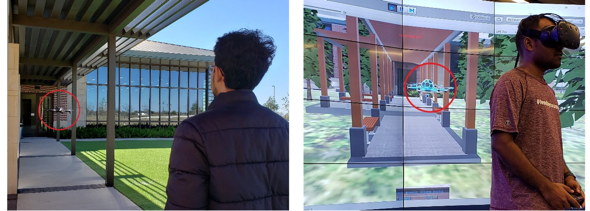
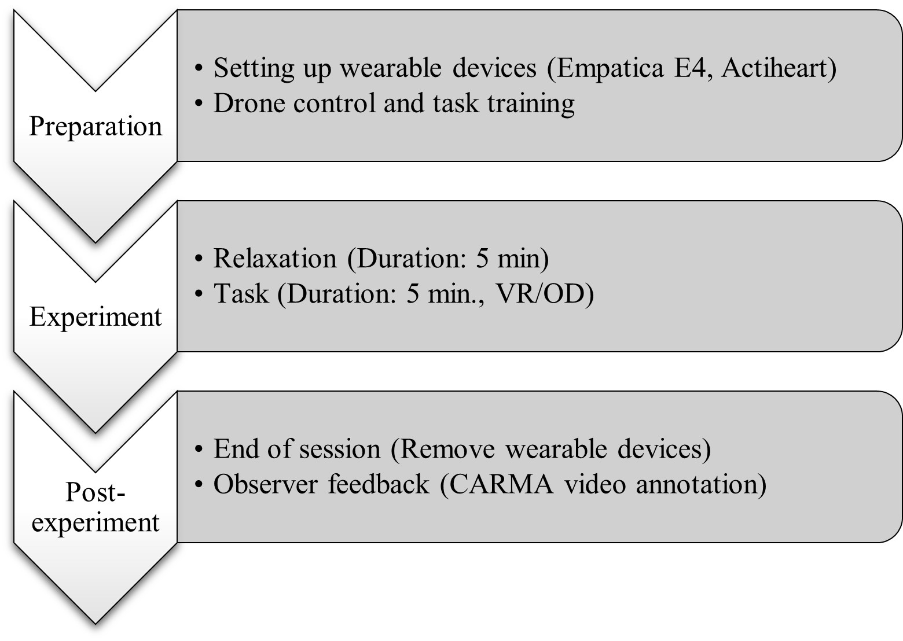
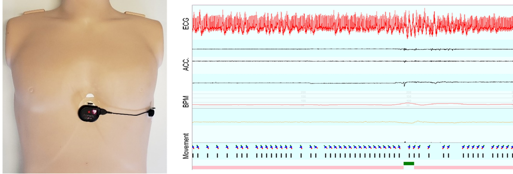
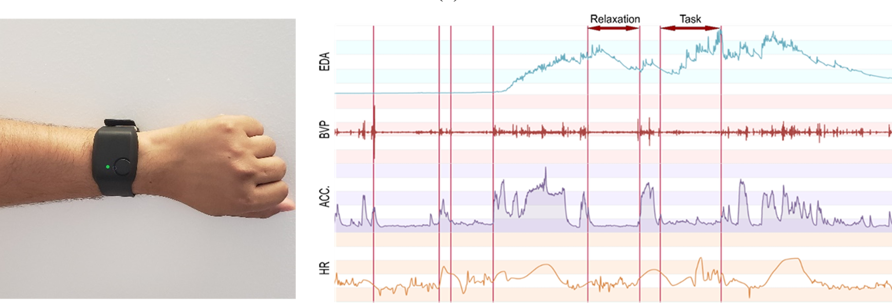
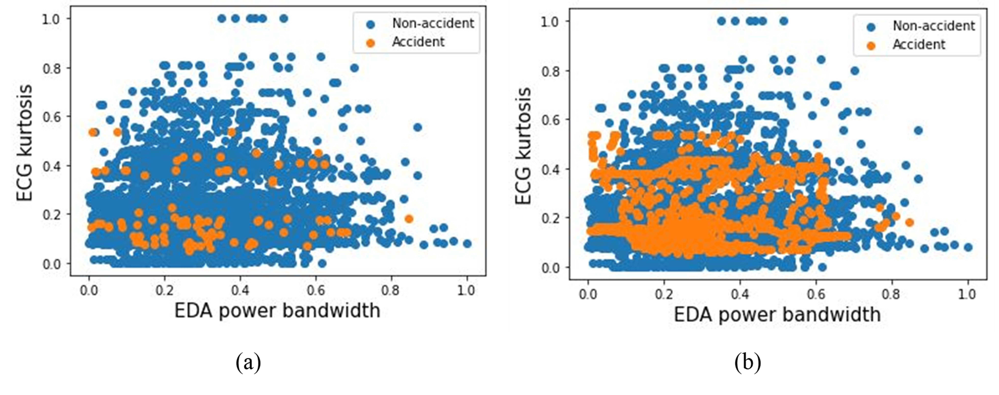
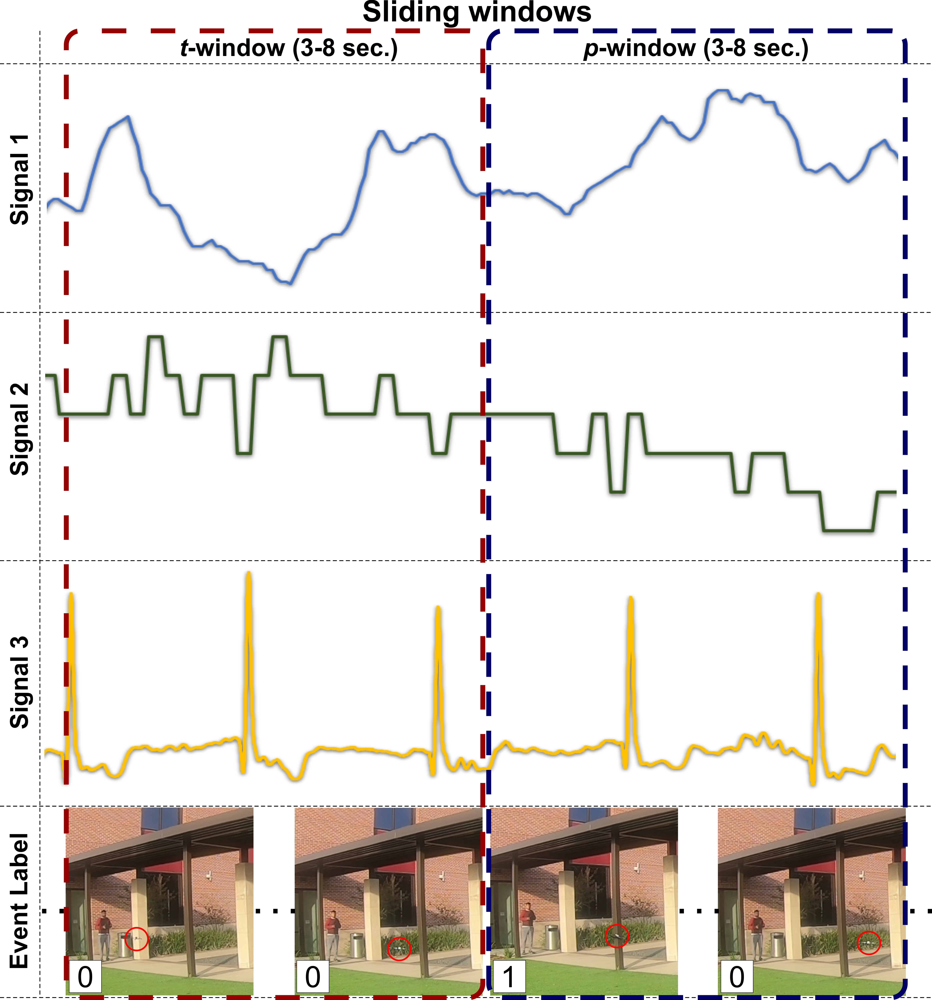

# **Feed-forward Neural Network (FNN) for Drone Accident Prediction from Physiological Signals**

## **Table of Contents**
1. [Introduction](#introduction)
2. [Implementation](#implementation)
3. [Data collection protocol](#protocol)
4. [Dataset](#dataset) ([download](https://drive.google.com/drive/folders/1jrGqgwpBh1hD354zGkpxY7JTZTe13QgY?usp=sharing))
5. [FNN model](#Models)
6. [Tutorials](#tutorials)
7. [Institutional Review Board (IRB)](#IRB)

## **Introduction**

Unmanned aerial vehicles (UAVs), commonly known as drones, are a major game-changer in construction and civil infrastructure projects, and are rapidly transforming the traditional way of conducting tasks such as surveying, safety inspection, and progress monitoring. While the industry is still years away from implementing autonomous drones on the jobsite, human operators still play a critical role in ensuring safe drone missions in compliance with operational protocols such as those of the United States Federal Aviation Administration (FAA) and the European Union Aviation Safety Agency (EASA). Research shows that operator’s stress and fatigue are among the leading causes of drone accidents. Our previous work suggests that physiological data collected by nonintrusive wearable devices can accurately predict drone operator’s performance, mental workload, and stress. In this research, we use data from real-world and virtual reality flight experiments to design an artificial neural network (ANN) model coupled with a robust feature engineering (feature extraction and selection) scheme for exploring the complex interactions between drone operator’s time-series physiological signals (e.g., electrocardiogram, electrodermal activity, heart rate, skin temperature) as explanatory variables, and the likelihood of an imminent drone accident. The findings of this study will lay the foundation for future work in creating automated intervention systems for drone operations, ultimately leading to safer jobsites [[1]](#1).

### Article

[**A feedforward neural network for drone accident prediction from physiological signals**](https://doi.org/10.1108/SASBE-12-2020-0181) \
Md Nazmus Sakib, Theodora Chaspari, Amir H. Behzadan \
Journal: Smart and Sustainable Built Environment (SASBE), 2021, ISSN: 2046-6099
DOI: https://doi.org/10.1108/SASBE-12-2020-0181

Please cite the article if you use the dataset, model or method(s), or find the article useful in your research. Thank you!

### LaTeX citation:

@article{Sakib2021,
    author  = {Md Nazmus Sakib and Theodora Chaspari and Amir H. Behzadan},
    title   = {A feedforward neural network for drone accident prediction from physiological signals},
    journal = {Smart and Sustainable Built Environment},
    volume  = {ahead-of-print},
    year    = {2021},
    pages   = {ahead-of-print}

## **Implementation**

### Dependencies
- `Scikit-learn`
- `numpy`
- `smote`
- `tsfel`
- `matplotlib`
- `pandas`

**Please stay tuned! The detailed description of the implementation is coming soon**

## **Protocol**
The data collection protocol was:

## **Dataset**
This dataset consists of different time-series physiological signals (i.e., Electrocardiogram, Electrodarmal Activities, Skin Temperature, Heart Rate) collected during and outdoor and virtual reality 5 minutes long drone flying experiments. A total of 25 participants (19 male, 6 female) of 25~30 years old from Texas A&M University, participated in the data collection.
### Wearable devices
Figure shows the Actiheart 5, chest wearable device. Manufactured by CamNtech Ltd. 

Figure shows the Empatica E4, wrist wearable device. Manufactured by Empatica Inc. 

### Time-series signals
- Electrocardiogram (ECG or EKG)
    - Recording device: Actiheart 5
    - Sampling frequency: 1024 Hz
- Electrodermal activity (EDA) or galvanic skin response (GSR)
    - Recording device: Empatica E4
    - Sampling frequency: 4 Hz
- Skin temperature (ST)
    - Recording device: Empatica E4
    - Sampling frequency: 4 Hz
- Heart rate (HR)
    - Recording device: Actiheart 5 and Empatica E4
    - Sampling frequency: 1 Hz
    
### Dataset description

The dataset contains physiological signals from 25 participants (19 males, 6 females) of 25-30 years of age, which was conducted in two sessions, namely OD and VR. Each session comprised two tasks (easy and complex). For each participant, the order of the OD and VR sessions was randomized; some participated in the OD session first, and some participated in the VR session first. Overall, 10 participants performed the VR session first while the remaining performed the OD session first. For outdoor experiments, three drone models (i.e., Parrot Bebop 2, Parrot Anafi, Tello Quadcopter) with similar control functions but slightly different speeds were used. The drone model used in the VR environment was developed with similar control functions and simulated speed of Parrot Bebop 2. [[2]](#2)

### Time-domain features
A total number of 13 time-domain features were extracted from EDA, ST, ECG and HR. Which are maximum, minimum, maximum slope, mean, median, skewness, kurtosis, standard deviation, variance, area under the curve, approximate entropy, sample entropy, and zero crossing [[1]](#1).
### Frequency-domain features
Time-domain signals were converted to frequency-domain using Fast Fourier transform. A total of 13 frequency-domain features were extracted from the converted signal. Which are average phase, average magnitude, total energy, spectral distance, maximum frequency, median frequency, spectral entropy, maximum power spectrum, power bandwidth, spectral kurtosis (not applicable to HR signal), spectral skewness (not applicable to HR signal), spectral variation, and fundamental frequency [[1]](#1).

### Type of dataset
# Raw dataset
There are 4 time-series raw signals (i.e., ECG, EDA, HR, ST) for all 25 participants in both outdoor and virtual reality. Each session duration for each participants were 5 minutes. Original label data is with 1 Hz frequency manually annotated by third-party observer.
# Filtered
Raw time series physiological signals were preprocessed to replace missing values and outliers. Digital filters were also applied to remove noises from the signals. Original label data is with 1 Hz frequency manually annotated by third-party observer.
# Extracted feature with labels
For each time series signal, a sliding analysis window of t=3-8 seconds with 1-second increment is used to extract 13 time-domain and 13 frequency-domain features. The final label of each analysis window is obtained considering the presence or absence of a drone accident event in the corresponding prediction window (p=3-8) that immediately follows. In total, 36 datasets of different combinations of analysis windows and prediction horizons (t=3-8 seconds and p=3-8 seconds, with 1-second increments). 

### Final Dataset for analysis
After selecting best t-p top features were ranked using ReliefF and training dataset was balanced using synthetic minority oversampling technique (SMOTE) [[1]](#1).

### Download the dataset

To download this dataset please fill out the [Dataset Download Request Form](https://docs.google.com/forms/d/e/1FAIpQLSe-47QX3it0NLLQsbtcpbNO8A0nBkw7yJ5Soq6ZfHzsATy1UQ/viewform?usp=sf_link).

**Note:** These datasets are strictly for research purposes. Can not be redistributed to anyone else or put anywhere for public access. Once research purposes are completed, please destroy the original files. The participants identifying information (if any) can not be revealed publicly or in a research paper/presentation.

## **Methods/Approaches**

This paper presents below approaches to predict an accident: [[1]](#1)

## **Results**

- The F1-score and average-precision (AP) of model to predict accident:

- The training (t) and prediction (p) window as 8 seconds and 6 seconds respectively:

## **Models**

The models used for analysis available on the following links:

- FNN-v1
- FNN-v2

**Please stay tuned! Links to download the models well be added soon.**

## **Tutorials**

**Please stay tuned! The detailed step-by-step tutorials are coming soon.**

## **IRB**
Title: Study to understand drone operator’s physiological state

IRB# IRB2019-0782D, Date: 07/25/2019

Texas A&M University, College Station

## **References**
<a id="1">[1]</a> 
Sakib, M.N., Chaspari, T. and Behzadan, A.H., 2021. A feedforward neural network for drone accident prediction from physiological signals. 
*Smart and Sustainable Built Environment*. DOI: https://doi.org/10.1108/SASBE-12-2020-0181

<a id="2">[2]</a> 
Sakib, M.N., Chaspari, T. and Behzadan, A.H., 2021. Physiological data models to understand the effectiveness of drone operation training in immersive virtual reality. 
*Journal of Computing in Civil Engineering*, 35(1), p. 04020053. DOI: https://doi.org/10.1061/(ASCE)CP.1943-5487.0000941

## **Contact**
For more information please contact:

[Connected Informatics and Built Environment Research (CIBER) Lab](http://people.tamu.edu/~abehzadan/)

Department of Construction Science, Texas A&M University, College Station, TX.
